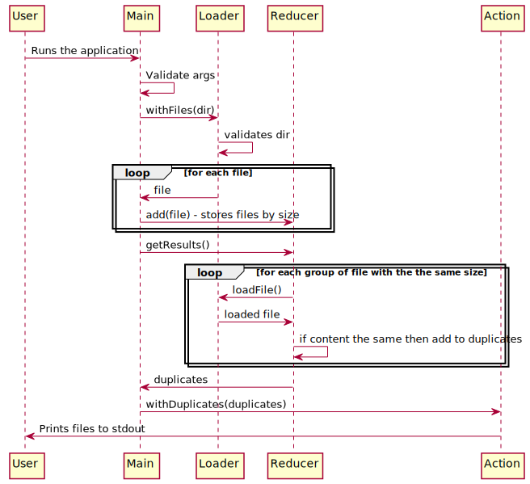

# find-duplicate-files

Command line tool to find duplicate files in given directory. The application finds duplicates by its content 
and will output relative paths of duplicate files.

## Usage

You need to install Java 8+ on your computer.

Usage:
`find-duplicate-files [DIR]`

## Build 

Build the application

`$ gradlew distZip`

A ready to go artifact will be generated in `build/distributions/find-duplicate-files.zip`

## Develop

The application is using [gradle](https://gradle.org) as build system.

To run unit tests:

`$ gradlew test`

To run the app:

`$ gradlew run [DIR]`

### Dependencies

No dependencies on external systems.

### Implementation Notes

Sequence diagram of the current implementation:

In current implementation, size of the file is used to do initial find of duplicates. That works quite efficient for image files (photos).
If there is a need to use this app for files that have similar size, but different content then it would be better
to add intermediate MD5 filter.
